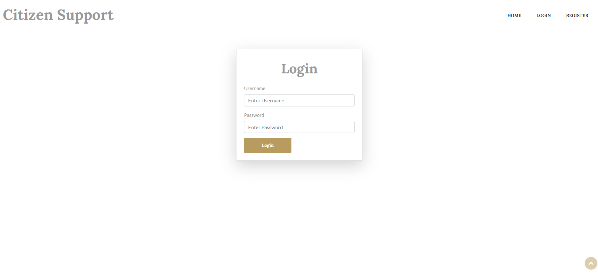
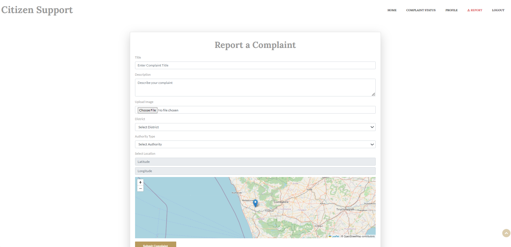
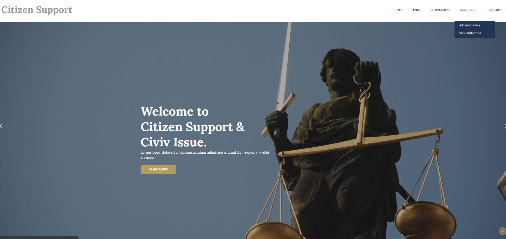
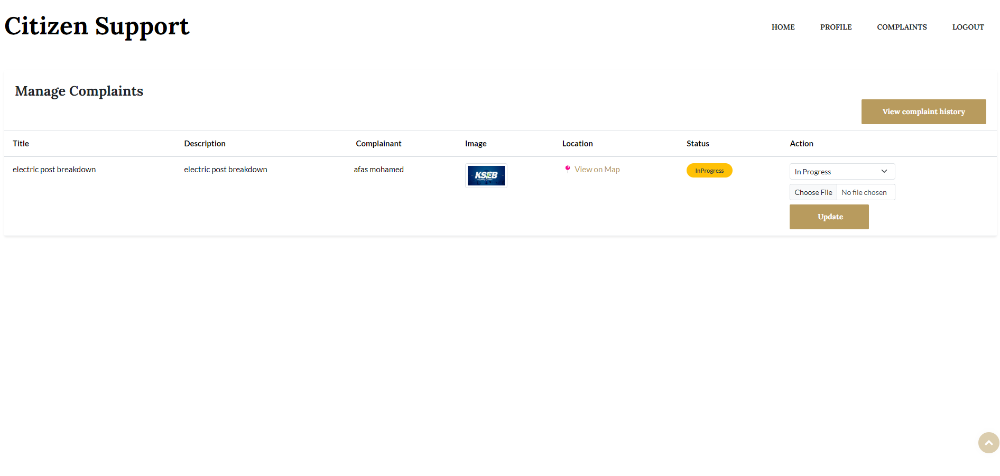

# 🏛️ Citizen Support and Civic Issue Management System

A Python Django-based web application designed to help citizens report civic issues such as road damage, water leakage, and power outages. The system provides real-time updates, structured complaint management, and communication between citizens and government authorities.

---

## 📌 Project Overview

This system enables:
- Citizens to report and track issues
- Authorities to respond and update complaint status
- Admins to manage the platform, assign departments, and generate reports
- Real-time email notifications for updates

---

## 🧩 System Modules

1. **Citizen Module**  
   - User registration & login  
   - Submit complaints with descriptions and optional images  
   - Track complaint status  
   - Submit feedback

2. **Authority Module**  
   - View and manage assigned complaints  
   - Update complaint status (Pending, Resolved)  
   - View citizen feedback

3. **Admin Module**  
   - Manage all users and authorities  
   - Assign complaints to departments  
   - Generate reports and statistics

4. **Notification Module**  
   - Send automatic email notifications on status updates

---

## 🎨 Technologies Used

- **Backend**: Python, Django
- **Frontend**: HTML, CSS, Bootstrap, JavaScript
- **Database**: SQLite
- **Email**: Django’s SMTP email system
- **Optional**: Google Maps API for geolocation tagging

---

## 📷 Screenshots

> Screenshots should be placed inside the `/screenshots/` folder

| Page | Preview |
|------|---------|
| Login Page |  |
| Complaint Form |  |
| Authority Dashboard |  |
| Complaint Tracking |  |

---

## 👤 Developer Info

**Afas Mohamed P M**  
MCA Final Year Student  
SCMS School of Technology and Management

